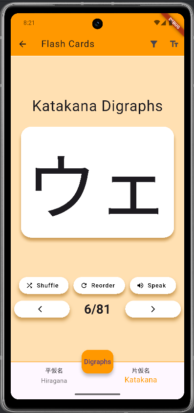

# Kanaji

A Flutter project for learning the Japanese alphabet — **Hiragana**, **Katakana**, and **Kanji** — through exploration and flashcards.

# Project state

The project is not finished, since kanji page is incomplete, with limited symbols only. The data is also stored only locally.

## Walkthrough

The app consists of **three main pages** — one for each writing system. On each page, users can browse all characters and tap on them to hear their pronunciation via text-to-speech.

### Main Pages

- **Katakana**

  

- **Hiragana**

  

- **Kanji**

  

You can tap any symbol to hear how it's pronounced:

### Flashcards

Pressing the flashcard button at the top opens a learning mode with randomized flashcards, including audio playback:

- **Main Flashcards**

  

- **Digraphs Flashcards**

  

### Font Switching

To help you recognize characters in different contexts (e.g. signage, handwriting), a top-bar button allows switching between fonts:

---

